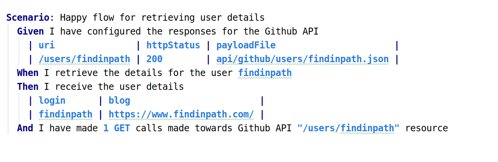
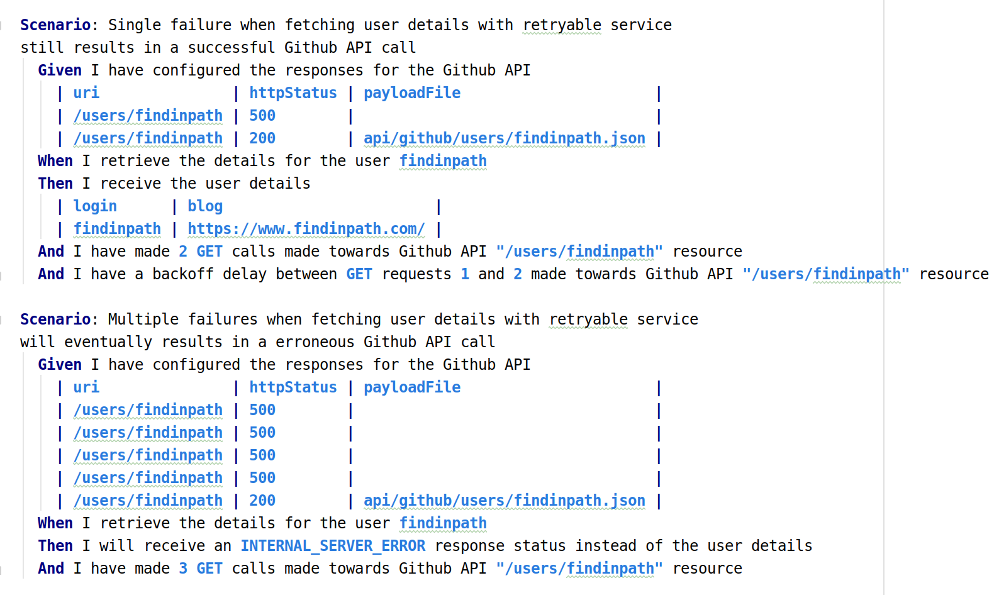

Executable test specifications for Spring Retry Beans with Cucumber
===================================================================

This project showcases on how to test [spring-retry](https://github.com/spring-projects/spring-retry)
retryable functionality with [Cucumber](https://github.com/cucumber/cucumber-jvm) library.

The outcome of using [Cucumber](https://cucumber.io/docs) for test purposes
are very easy to read test specifications which empower even non-technical
users to get a good feeling about the expected functionality of the 
application.

Below are presented the accuracy & failure test scenarios for a Github API
client with [spring-retry](https://github.com/spring-projects/spring-retry)
configured functionality.

 

The [spring-retry]([spring-retry](https://github.com/spring-projects/spring-retry))
functionality is added on top of the basic Github API client via 
Spring AOP

Check an in-depth article regarding the introduction of metrics
via Spring AOP on the spring-retry functionality here 
https://www.findinpath.com/spring-retry-metrics/

For testing, the library [WireMock](http://wiremock.org/) is being used
for being able to mock the Github API.
Check more details on how to browse through the requests reaching WireMock
Server on the blog post: https://www.findinpath.com/wiremock-logged-requests/

[Cucumber Gherkin](https://cucumber.io/docs/gherkin/reference/) grammar rules 
used for parsing the executable test specifications are extended in this project
to be able to support custom types:

- `com.github.tomakehurst.wiremock.http.RequestMethod`
- `org.springframework.http.HttpStatus`

See in the images referenced above the highlighted tokens:

- `GET` (corresponds to `RequestMethod.GET`)
- `INTERNAL_SERVER_ERROR` (correspond to `HttpStatus.INTERNAL_SERVER_ERROR`)

to understand that the registration of custom types in Gherkin
has a clear outcome in better readability for the executable test
specifications.